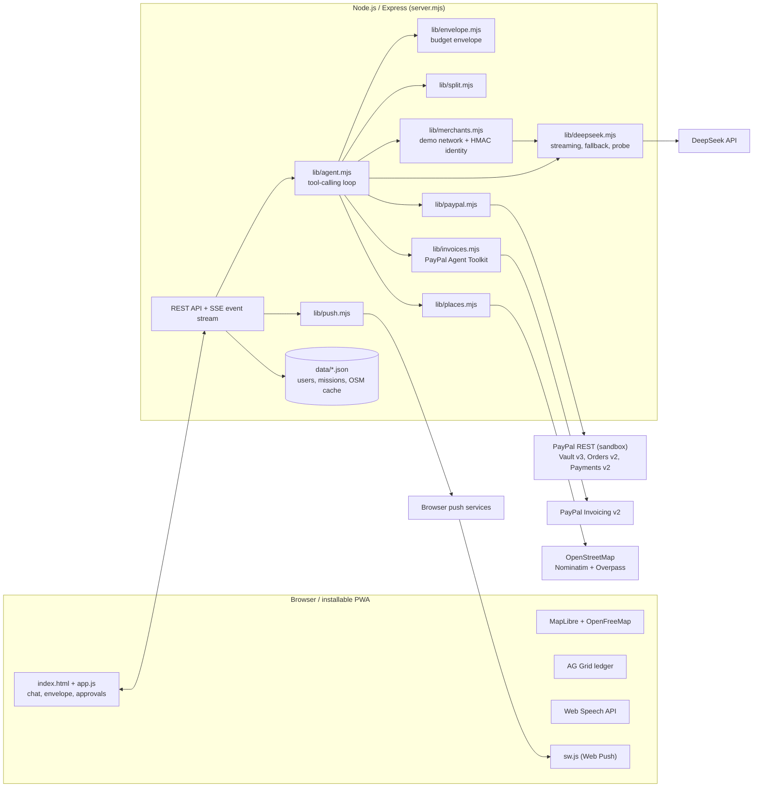

# Mandat

**Tell it what you want and how much you can spend. Mandat searches real places, negotiates with merchants' agents, books, and holds deposits with PayPal, never a cent over your mandate.**

Built for the PayPal AI Hackathon (Devpost, 2026). Everything runs on the **PayPal sandbox**, so no real money moves.

- Hosted demo: `https://<your-render-service>.onrender.com` *(see [Deploy on Render](#deploy-on-render))*
- Stack: Node.js 20+, Express, plain HTML/CSS/JS (installable PWA), PayPal REST APIs + PayPal Agent Toolkit, DeepSeek

---

## The problem

Handing an errand to an AI agent ("book dinner for six on Saturday, get a cake and flowers, 300 € max") is easy to say and hard to trust. Today an agent either cannot pay at all, so you finish every booking yourself, or it gets a card with no real limit and no record of what it did.

Mandat is for people who want the errand done but keep control of the money: a **signed PayPal mandate**, a **budget envelope per mission**, deposits that are **held rather than charged**, approvals at the level of autonomy you choose, and a ledger of every movement.

## What it does

| Feature | How it works |
|---|---|
| **Sign a mandate once** | One trip to PayPal saves your PayPal account with **Vault v3** (setup token, then payment token). That trip also connects your account (name and email come back with the token). You set a monthly limit and an autonomy level. |
| **One budget envelope per mission** | Each mission has its own envelope: total / held / paid / remaining. Every payment is checked against it first (`lib/envelope.mjs`), and the monthly limit is checked when a mission is created. |
| **Ask by text, voice, or photo** | Type, speak (Web Speech API; replies are read aloud with `speechSynthesis` and stop when you start talking), or attach a photo (a receipt, a flyer, a broken bike). The photo is read once by the model and kept as a text description. |
| **Real places on a map** | The agent searches real nearby places with OpenStreetMap (Nominatim + Overpass) and shows them on an interactive map inside the conversation (MapLibre + OpenFreeMap). |
| **Negotiation with merchant agents** | Bookings go through a demo merchant network. Merchants that run an AI agent quote and negotiate (availability, discounts, counter-offers) inside their own private rules, and the exchange is shown live. |
| **Know Your Agent** | Before negotiating or paying, the buyer agent checks the merchant agent's identity card, signed by the network with HMAC-SHA256 (`verify_merchant`). |
| **Booking requests for merchants without AI** | For small merchants with no agent, Mandat sends a structured booking request (items from their catalogue, slot, deposit) to a **private merchant inbox** (`/merchant/:id?k=…`, an HMAC-signed link; in production it would arrive by SMS or email). The merchant taps **Accept**, **Other time** (counter-proposal) or **Decline** — no app, no AI on their side. After they accept, the shopper's agent holds the deposit with PayPal; the merchant then taps **Confirm & collect** and the deposit is captured. |
| **Holds, not charges** | Deposits are PayPal **authorizations** (Orders v2, `intent: AUTHORIZE`) paid with the vaulted token, so the money is reserved, not spent. If the plan changes, the agent **voids** the authorization. |
| **Approvals by autonomy level** | *Careful* asks before every payment, *Balanced* pays small deposits alone and asks above your limit, *Autopilot* acts on its own inside the mission budget and reports each step. A **daily limit** across all missions still applies: above it, the agent must ask. Pending payments appear as an Approve / Decline sheet. |
| **Split the bill** | Exact to the cent (`lib/split.mjs`): equal or unequal shares, rounding cents assigned to whoever paid. Each friend gets a **detailed PayPal invoice** (bill lines with their part, who paid, where, when, how it was split) with a pay link and a **QR code**. PayPal also emails it when an address is known. Paid invoices show up in the mission. |
| **Notifications** | Web Push (VAPID) only for moments that need you: approvals, a question from the agent, a merchant accepting or declining, a friend paying, a mission fully booked. Nothing is sent while you are looking at that mission. |
| **Activity ledger** | Every money movement across missions in an **AG Grid** ledger (held / paid / released / refunded / owed to you / paid back, with the PayPal reference), with a **natural-language filter** ("refunds in October", "what Sam still owes"). |
| **Stop switch** | One toggle freezes all payments for every mission, and each mission also has its own stop button. A mission that still holds money cannot be deleted. |

No sign-up: each browser gets its own private space through an HTTP-only cookie.

## How PayPal is used

| PayPal API / product | Where in the code | Why |
|---|---|---|
| **[PayPal Server SDK](https://github.com/paypal/PayPal-TypeScript-Server-SDK)** (`@paypal/paypal-server-sdk` 2.5.0, generated by APIMatic) | `lib/paypal.mjs` | Every call below goes through the official SDK: one `Client` (OAuth 2.0 client credentials handled by the SDK), and the `VaultController`, `OrdersController` and `PaymentsController` with typed request models. Integrated with the **APIMatic Context Plugin for PayPal**, whose skills set the rules we follow: pinned version, a per-attempt timeout, typed `CustomError` mapping, and retries that include POST only because every write is idempotent. |
| **Vault v3: setup tokens** (`VaultController.createSetupToken`) | `lib/paypal.mjs` → `createMandateSetup()`, called by `POST /api/me/mandate` | Starts the mandate: the user approves once on PayPal (`usageType: MERCHANT`, `customerType: CONSUMER`). |
| **Vault v3: payment tokens** (`VaultController.createPaymentToken`) | `lib/paypal.mjs` → `activateMandate()`, called by `GET /mandate/return` | Turns the approved setup token into a reusable payment token. That token **is the mandate**: the agent can pay without the user being present. |
| **Orders v2** (`OrdersController.createOrder`, `intent: AUTHORIZE`, `paymentSource.paypal.vaultId`) | `lib/paypal.mjs` → `hold()`, used by the agent tool `hold_deposit` through `doHold()` in `lib/agent.mjs` | Holds a deposit for an agreed offer. The money is reserved, not captured. |
| **Payments v2: capture / void / refund** (`PaymentsController.captureAuthorizedPayment`, `voidPayment`, `refundCapturedPayment`) | `lib/paypal.mjs` → `capture()`, `release()`, `refund()`; `captureEntry()` and the tools `cancel_hold` / `refund_payment` in `lib/agent.mjs`; `POST /api/merchants/:mid/requests/:rid/collect` in `server.mjs` | Capture when the merchant confirms (instantly for merchants with an agent, from the inbox for the others); void when the plan changes before that; refund after capture when a booking is cancelled. |
| **Invoicing v2 via the official [PayPal Agent Toolkit](https://github.com/paypal/agent-toolkit)** (`@paypal/agent-toolkit`): `create_invoice`, `send_invoice`, `generate_invoice_qr_code`, `get_invoice` | `lib/invoices.mjs` → `shareInvoice()`, `invoiceStatus()`; used by the agent tool `split_bill` and by a background check every 2 minutes in `server.mjs` | One real, itemised invoice per friend, with a pay link and a QR code. The toolkit's tools are called in the OpenAI tool-call shape (`handleToolCall`), exactly as an agent framework would. |
| **Idempotency** (`PayPal-Request-Id`, the SDK's `paypalRequestId`) | `lib/paypal.mjs` | Every money-moving call carries a fresh idempotency key, so a retry can never charge twice. |

**Sandbox app features to enable** (developer.paypal.com → your sandbox app): **Save payment methods** (Vault) and **Invoicing**.

**Offline mode:** without PayPal keys the app still runs. Every PayPal call returns the same shape with fake ids and `mode: "offline"`, and the UI labels it "Demo mode" so it never pretends money moved.

## How AI is used

- **The agent: DeepSeek with tool calling** (`lib/agent.mjs`, `lib/deepseek.mjs`). DeepSeek is OpenAI-compatible, and the agent loop runs up to 14 tool steps per user turn. Tools: `find_real_places`, `find_network_merchants`, `verify_merchant`, `negotiate`, `request_booking`, `hold_deposit`, `cancel_hold`, `split_bill`, `update_plan`. Every step is emitted as an event and streamed to the browser with Server-Sent Events, so you watch the agent work.
- **Guardrails live in code, not in the prompt.** Even if the model asks, `hold_deposit` checks the envelope and the approval threshold, `request_booking` rejects items a merchant does not sell and requests the mandate cannot pay, and `doHold` refuses when a stop switch is on.
- **Vision.** A photo is sent once to the model as image input. A precise text description (names, prices, dates, addresses) is kept in the conversation instead of the image.
- **Merchant agents** (`lib/merchants.mjs`). Each demo merchant with `hasAgent: true` is a DeepSeek agent with its own catalogue and private floor rules. It replies in JSON with a structured offer (items, discount, total, deposit, slot, conditions).
- **Natural-language ledger filter** (`POST /api/me/activity/ask` in `server.mjs`). A request in plain words becomes an AG Grid filter model in JSON mode, limited to a whitelist of columns.
- **Mission titles.** The fast model writes a 2–5 word title in the background, and a plain title is shown instantly in the meantime.
- **Streaming.** Replies stream token by token, and a stalled stream (no progress for 20–45 s) counts as a hang.
- **Cost and reliability controls** (`lib/deepseek.mjs`):
  - *Prefix caching:* the stable instructions come first and the changing budget state comes last, so DeepSeek bills the repeated prefix as a cache hit. Each call logs its tokens and cache-hit percentage.
  - *Fast model by default, fallback on failure:* `DEEPSEEK_FAST_MODEL` serves every call. On a timeout, a 429 or a 5xx, the call moves once to `DEEPSEEK_SMART_MODEL`, and a half-streamed reply is replaced cleanly.
  - *Health probe:* a model that hung is skipped. An 8-token probe re-checks it at most every 5 minutes, so no user waits on a broken model.

## Architecture



## Run locally

**Requirements:** Node.js 20 or newer, a DeepSeek API key, and (optionally) a PayPal sandbox app.

```bash
git clone <this repo>
cd PayPalCreatorAgent
npm install
cp .env.example .env    # then fill in the values (see below)
set -a; source .env; set +a
npm start               # or: node server.mjs
```

Open `http://localhost:8790`.

| Variable | Required | Purpose |
|---|---|---|
| `DEEPSEEK_API_KEY` | **yes** | The agent, the merchant agents, photo reading, the ledger filter. Without it the server starts but the agent cannot answer. |
| `PAYPAL_CLIENT_ID`, `PAYPAL_CLIENT_SECRET` | recommended | PayPal **sandbox** app keys. Without them the app runs in clearly labelled offline demo mode. |
| `PUBLIC_URL` | when hosted | Public https base URL, used for PayPal return URLs and invoice links. Defaults to `http://localhost:<PORT>`. |
| `PORT` | no | Defaults to `8790`. |
| `DEEPSEEK_FAST_MODEL`, `DEEPSEEK_SMART_MODEL` | no | Override the default and fallback models. |
| `VAPID_PUBLIC_KEY`, `VAPID_PRIVATE_KEY`, `VAPID_SUBJECT` | no | Web Push keys. If absent, a key pair is generated once and saved to a private (mode 600) file. |
| `MANDAT_DATA` | no | Data directory, defaults to `./data` (gitignored). |
| `MANDAT_TURNS_PER_USER_DAY`, `MANDAT_MISSIONS_PER_USER_DAY`, `MANDAT_TURNS_PER_DAY`, `MANDAT_WRITES_PER_MINUTE` | no | Public-demo guards (defaults 80, 15, 3000, 40): daily AI allowance per person and for the whole app, plus a per-IP burst limit on writes. They keep the AI bill bounded while judges test the hosted demo. |
| `MANDAT_NETWORK_SECRET` | no | Signing key of the demo merchant network. Random at each start if absent. |

Local alternative to environment variables: `PAYPAL_KEY_FILE` and `DEEPSEEK_KEY_FILE` can point to JSON files (`{"client_id","client_secret"}` and `{"api_key"}`). The server refuses to read them unless they are `chmod 600`.

**Signing the mandate in the sandbox.** "Sign mandate with PayPal" opens the PayPal sandbox. Log in with a **sandbox personal (buyer) account**: either the one given in the Devpost testing instructions, or one you create under *Testing Tools → Sandbox Accounts* on developer.paypal.com. Never use a real PayPal login.

**Try it without the UI.** `node scripts/scenario.mjs` runs a full "birthday evening" mission in the terminal (search, negotiation, booking requests, approvals, holds). It approves payments and accepts merchant requests automatically. It needs `DEEPSEEK_API_KEY` and runs with PayPal in offline mode.

## Deploy on Render

The repo includes a Render Blueprint: [`render.yaml`](render.yaml).

1. On Render, choose **New → Blueprint** and select this repository.
2. Fill in the secrets Render asks for: `PAYPAL_CLIENT_ID`, `PAYPAL_CLIENT_SECRET`, `DEEPSEEK_API_KEY`, `VAPID_PUBLIC_KEY`, `VAPID_PRIVATE_KEY`, and `PUBLIC_URL` (the service's `https://….onrender.com` URL). To generate a VAPID pair, run `npx web-push generate-vapid-keys`.
3. In the PayPal sandbox app, enable **Save payment methods** and **Invoicing**.

Notes on the free plan:
- **The disk is ephemeral.** Users, missions and the OSM cache in `data/` are reset on every redeploy or restart. That is fine for a demo, and the PayPal sandbox keeps its own records.
- A free instance sleeps after about 15 minutes without traffic. [`.github/workflows/keepalive.yml`](.github/workflows/keepalive.yml) calls the site every 10 minutes so it stays awake for judges. To turn it on, set the repository variable (or secret) `MANDAT_URL` to the hosted URL. Without it, the workflow skips.

## Tools used

| Tool | Used for |
|---|---|
| **PayPal Server SDK** (`@paypal/paypal-server-sdk`, sandbox): Vault v3, Orders v2, Payments v2 | Mandate, deposit holds, captures on confirmation, voids, refunds |
| **APIMatic Context Plugin for PayPal** | Coding-agent context used to integrate the PayPal Server SDK |
| **PayPal Agent Toolkit** (`@paypal/agent-toolkit`) | Invoicing v2 tools for split bills: create, send, QR code, status |
| **DeepSeek API** (OpenAI-compatible) | Tool-calling agent, merchant agents, photo reading, ledger filter, titles |
| **OpenStreetMap**: Nominatim + Overpass | Geocoding and real nearby places, cached on disk, with a custom User-Agent, per the usage policies |
| **MapLibre GL JS + OpenFreeMap** | Interactive map inside the conversation, no API key |
| **AG Grid Community** | Activity ledger |
| **Web Push** (`web-push`, VAPID) + Service Worker | Notifications and the app badge |
| **Web Speech API** (`SpeechRecognition`, `speechSynthesis`) | Voice in and voice out, in the browser |
| **Express** | HTTP server, static files, Server-Sent Events |
| **Render** | Hosting (free web service) |
| **GitHub Actions** | Keep-alive ping for the hosted demo |

## Safety

- **Never over budget.** Every hold goes through `Env.check()`: if the amount is more than what is left in the mission's envelope, it is refused in code, whatever the model asks. Booking requests the envelope cannot pay are never sent, and a new mission cannot push you past your monthly limit.
- **Holds before captures.** Deposits are authorizations, not charges, and a changed plan voids them. A mission with money still held cannot be deleted.
- **You decide how much it may do alone.** Payments above your autonomy threshold wait for your tap.
- **Stop switch.** It works globally and per mission, and blocks every new payment immediately.
- **Know Your Agent.** The merchant agent's identity card is verified before negotiating or paying.
- **Secrets never in the repo.** Keys come from environment variables or from private `chmod 600` files outside the project, and they are never logged. `.env`, `*.key` and `data/` are gitignored.
- **Minimal data.** From PayPal, Mandat stores only the payer's name, email and the vault payment token id. The user can see "What Mandat knows" and erase it in Settings.

## Sandbox disclaimer

This is a hackathon demo. **All payments use the PayPal sandbox. No real money moves.** The merchants (Lumière, L'Ombre Rouge, Atelier Sucré, Pivoine, Hôtel des Arts) are fictional demo merchants. The places shown on the map are real OpenStreetMap data, but bookings only go to the demo network.

## License

[MIT](LICENSE) © 2026 Blanco
